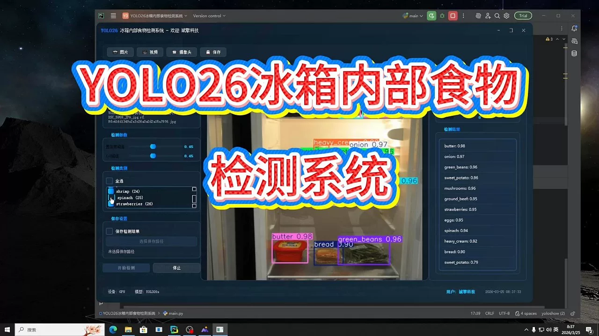
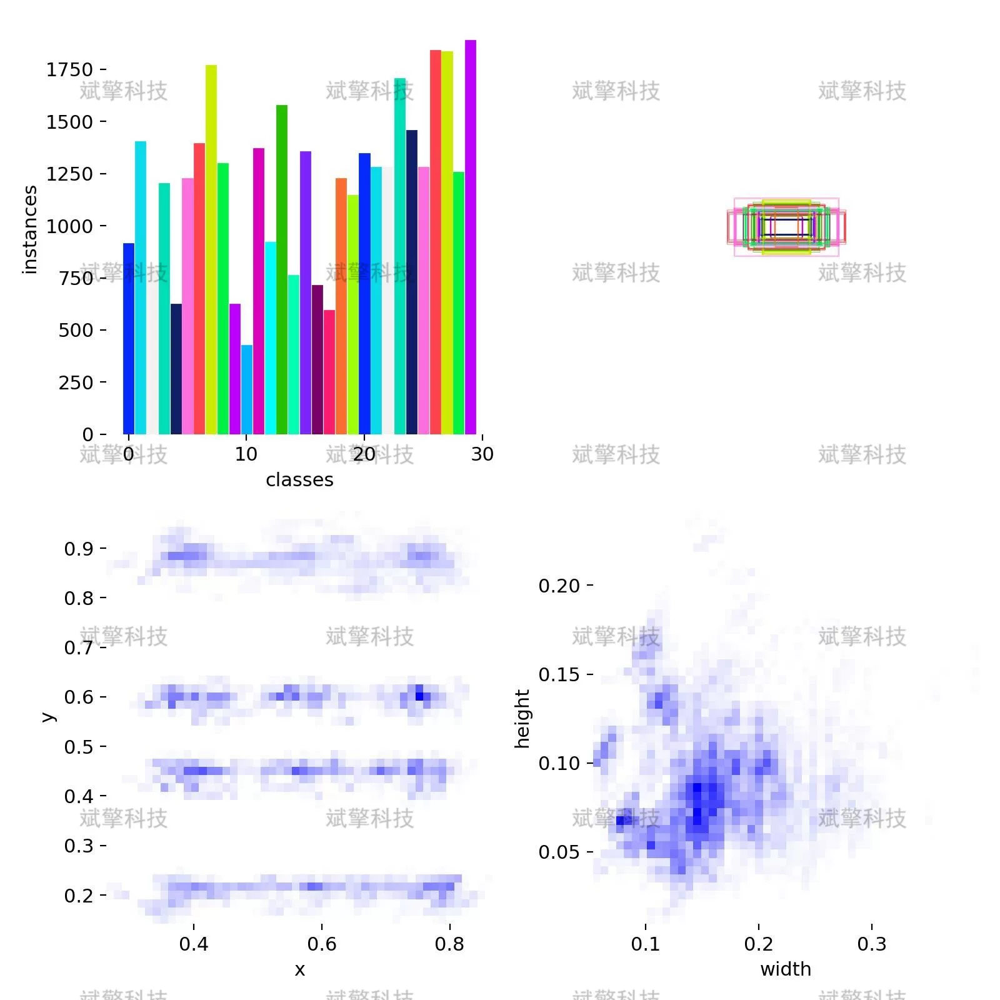
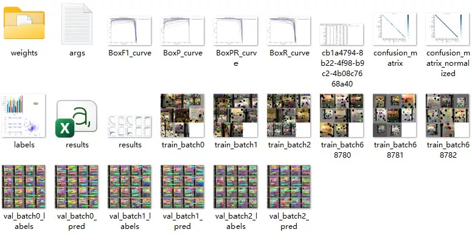
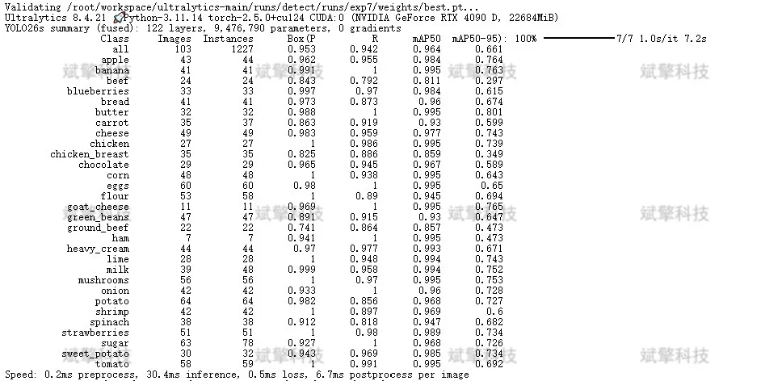
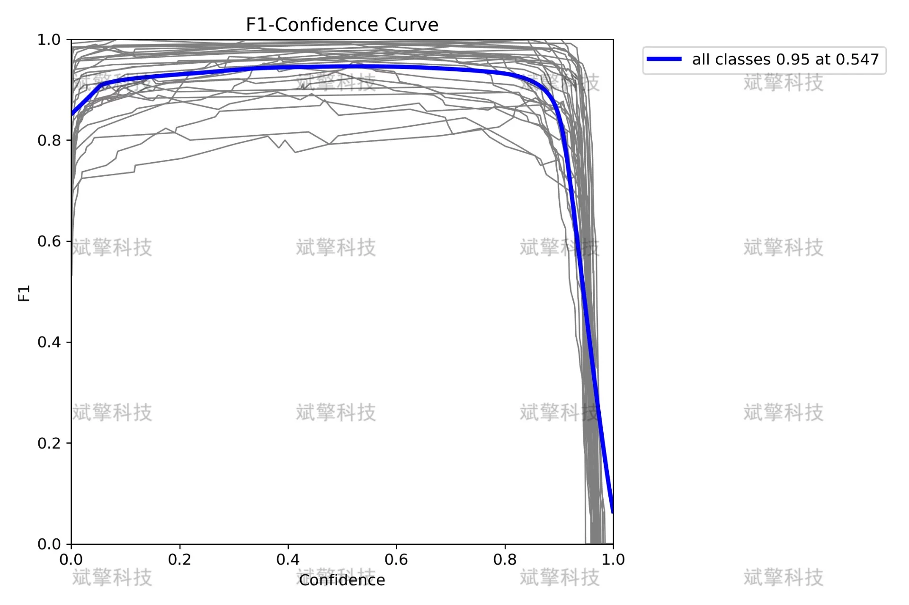
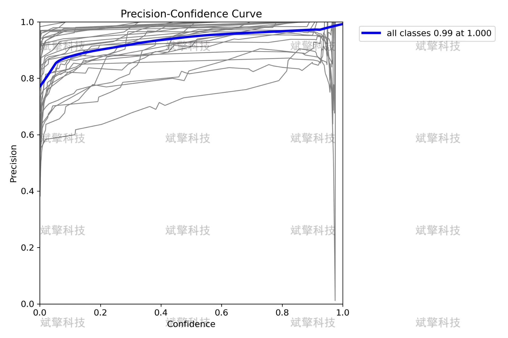
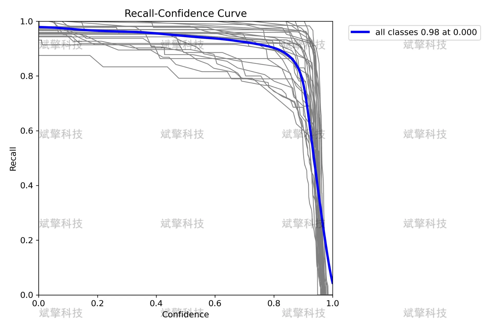
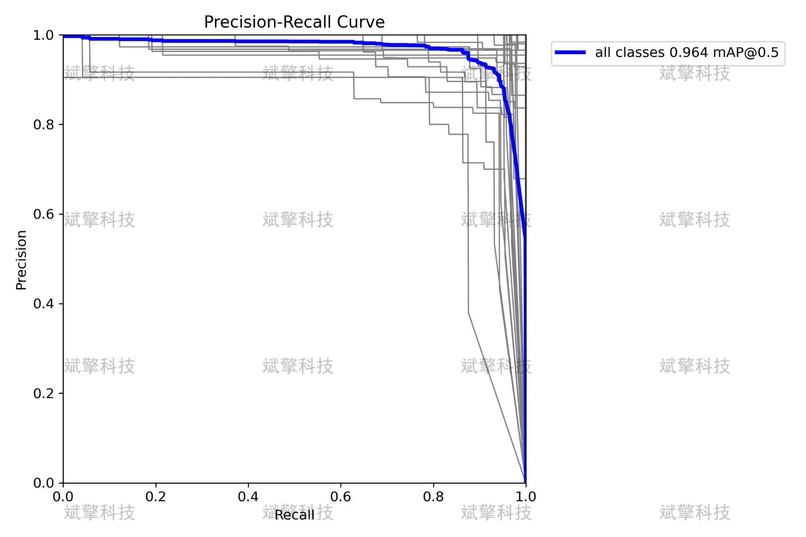
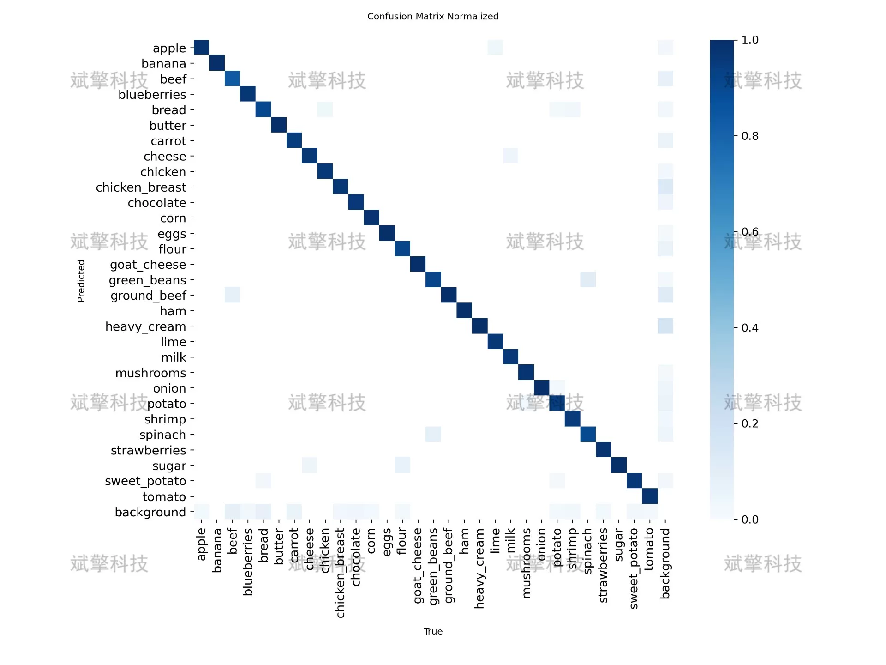

# YOLOv26 Refrigerator Internal Food Detection System | Source Code

## Body

YOLO26 Refrigerator Internal Food Detection System | Source Code for High Precision Refrigerator Internal Food Detection System: Based on YOLO26 for 30-Class Object Recognition and Localization

This article proposes a refrigerator internal food detection system based on YOLO26 for smart refrigerator applications. The system aims to achieve automatic recognition and localization of 30 common foods inside the refrigerator, including fruits, vegetables, meat, dairy products, and many other categories. The research adopts custom datasets for model training, which include 2896 training images, 103 validation images, and 51 test images, covering common food categories in daily life. The experimental results show that the model achieved an mAP50 of 0.964 on the validation set, with an accuracy rate of 0.953 and a recall rate of 0.942, demonstrating excellent detection performance. Among them, the recognition accuracy for most categories such as bananas, butter, and cheese is close to perfect, while there is still room for optimization in a few categories such as beef and chicken breast. This study provides an effective technical solution for the automation of food management in smart refrigerators.

The dataset covers 30 common food categories commonly found in daily life, specifically: apple, banana, beef, blueberries, bread, butter, carrot, cheese, chicken, chicken breast, chocolate, corn, eggs, flour, goat cheese, green beans, ground beef, ham, heavy cream, lime, milk, mushrooms, onion, potato, shrimp, spinach, strawberries, sugar sweet potato, tomato.

Free reservation for remote installation. Unsuccessful installation will result in a full refund.
Purchase comes with the following resources (unlocked in Baidu Cloud):
- Complete source code for YOLO recognition detection project
- YOLO format datasets
- Training code + UI interface code
- Trained model + results images
- Software installation package
- Add WeChat to make a reservation for remote installation (automatically displayed after purchase) - Unsuccessful, full refund

⚙️ Core Functional Modules
Detection Capability
- Image detection: upload and detect immediately, returning detection boxes + category information
- Video detection: supports video files, analyzing frames accurately one by one
- Camera real-time detection: connects to USB camera to achieve dynamic monitoring
Interaction and Control
- Target selection: freely choose one or more categories for detection
- Real-time adjustment of parameters: adjustable confidence threshold & IoU threshold, flexibly controlling precision
- Results saving: save images/videos/camera detection results in one click
System and Data
- User login registration: Supports password strength detection + encryption storage
- Log recording: automatically records operation and error information (timestamped)

## Images

## Payment

Here is a pay link on Stripe ( https://buy.stripe.com/3cs8yP7sY87d0vu9AB ). Please contact me lonlonago@foxmail.com after funding $89, and I will send you a complete data files , thank you!

